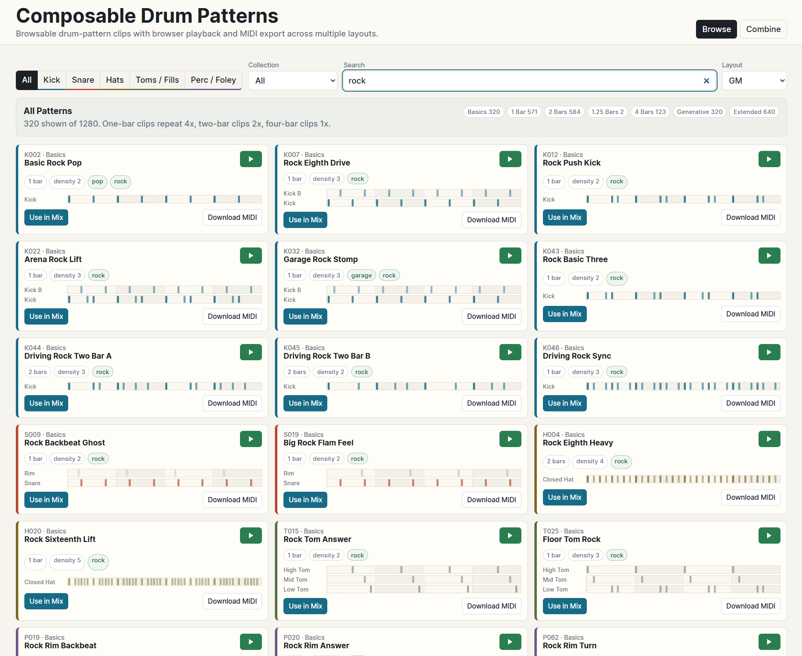
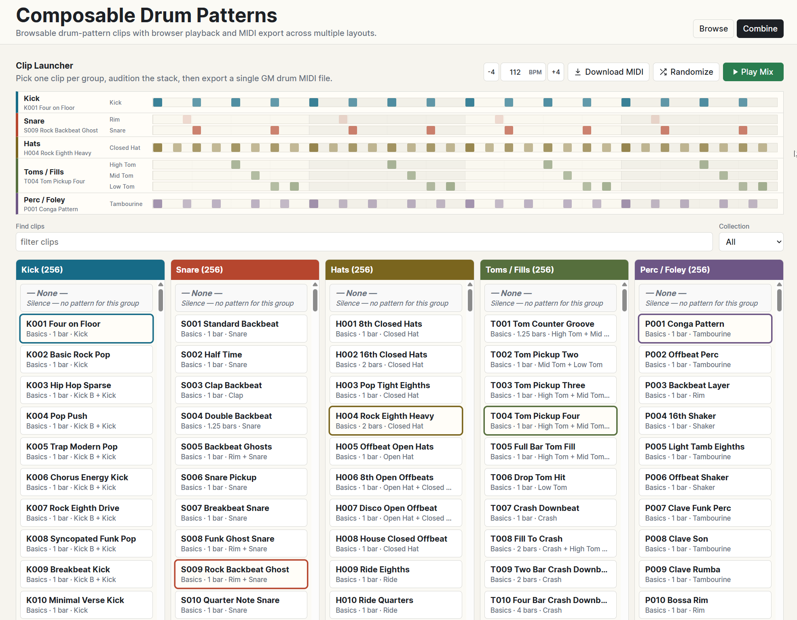

# Composable Drum Patterns

A browsable library of drum-pattern clips with browser playback and MIDI export
across multiple drum-map layouts: Bitwig Studio, Ableton Live, General MIDI, and
Triaz.

Browse, preview, and combine over 2,500 single-group drum clips. Each pattern is
a self-contained MIDI clip for one drum group (Kick, Snare, Hats, Toms/Fills, or
Perc/Foley). Stack compatible clips to build full drum parts.

| Browse | Combine |
| --- | --- |
|  |  |

## Features

- **Browse** patterns by group (Kick, Snare, Hats, Toms, Perc) and collection
  (Basics, Generative, Extended)
- **Preview** any clip with browser audio using Web Audio synthesis and samples
- **Combine** one clip from each group into a full stack with synchronized
  playback
- **Export** individual or combined patterns as MIDI files, generated in-browser
- Search by name, ID, tag, genre, or sound

## Credits

Audio samples are sourced from [Sampled](https://github.com/oramics/sampled)
(CC0 / public domain), a curated collection of open-license instrument samples.
Every abstract drum sound has a browser playback sample:

- Roland TR-505: kick, rim, clap, snare, hi-hats, crash, ride, ride bell, cowbell, toms
- Roland TR-808: shaker
- LinnDrum LM-2: tambourine
- MRK-2: kick B

Drum pattern synthesis uses the Web Audio API with additional synthesized drum
sounds as fallback.

## Creation Notice

This project was created with the help of coding agents. The MIDI pattern
library was also created with assistance from coding agents.

## License

All code and content in this repository is dedicated to the public domain under
[CC0](https://creativecommons.org/publicdomain/zero/1.0/).
